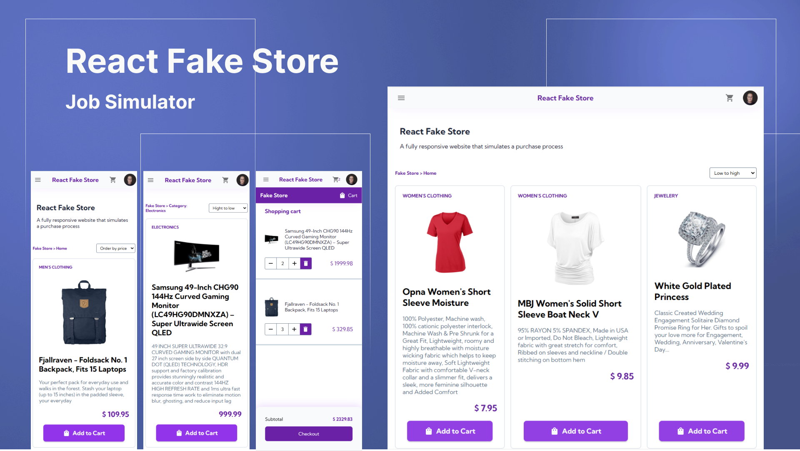

<h1 align="center">React Fake Store </h1>

Under construction

Personal project to practice knoldgements in HTML, CSS, JavaScript, Typescript and React.js.

  <a href="#Techs">Tech</a>&nbsp;&nbsp;&nbsp;|&nbsp;&nbsp;&nbsp;
  <a href="#Project">Project</a>&nbsp;&nbsp;&nbsp;|&nbsp;&nbsp;&nbsp;
  <a href="#Layout">Layout</a>&nbsp;&nbsp;&nbsp;|&nbsp;&nbsp;&nbsp;
  <a href="#Learn">What I've learned</a>

 

  

## Techs

This project was developed with following technologies:

- [HTML](https://developer.mozilla.org/pt-BR/docs/Web/HTML)
- [CSS](https://developer.mozilla.org/en-US/docs/Web/CSS)
- [JavaScript](https://developer.mozilla.org/pt-BR/docs/Web/JavaScript)
- [React.js](https://reactjs.org/)
- [Typescript](https://www.typescriptlang.org/)
- [Material UI](https://mui.com/)
- [Styled-components](https://styled-components.com/)

**React.js Features**

- [Context API](https://reactjs.org/docs/context.html)
- [Hooks](https://reactjs.org/docs/hooks-intro.html)
- [Custom Hooks](https://reactjs.org/docs/hooks-custom.html)

## Project

This project simulates a purchase process in a web store, the React Fake Store.
I used the [Fake Store API](https://fakestoreapi.com/) to fetch and mock data.

### Requirements and functionalities

**Rendering dinamic informations:**

- Application creates a menu list based on products categories;
- Application show indicators like: amount products on cart list, and witch category is selected.
- Application allows to order products by price: low to high and vice versa;
- In the **Cart** section, the application allows increment and decrement the product amount as well delete a product from cart;
- In the **Cart** section, the application calculates and updates the values dinamically;
- Application handles the fact that the cart is empty;
- It is possible to return to buy more products during cart manipulation.

**UI/UX aspects:**

- Users can view all products or products by category;
- There are functions and elements to allow fluid navigation between sections;

## Layout

I used Figma to build design.

## Learn

It was a big challenge to build this application using React.

This project is not yet complete. I like to refactor my designs as I gain more knowledge.

---

Made by [Anderson Vieira](https://linkedin/in/vieira-a)
